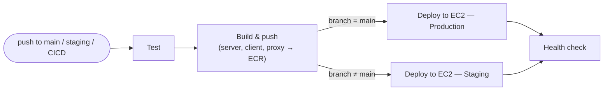

# Maple Garden Events

## CI/CD Architecture

Every push to `main`, `staging`, or `CICD` triggers the pipeline in [.github/workflows/deploy.yml](.github/workflows/deploy.yml). A single run deploys to **one** environment only — which one depends on the branch.

| Branch | Environment |
|---|---|
| `main` | production |
| anything else (`staging`, `CICD`, ...) | staging |

**Deploy job**, once images are built and pushed to ECR:
1. Copies `docker-compose.prod.yml` to the EC2 host
2. Pulls the `server`, `proxy`, and `client` images tagged with the commit SHA
3. Substitutes the `__PLACEHOLDER__` values in the compose file with real registry/domain/tag
4. `docker compose up -d --remove-orphans`, then prunes old images
5. Polls `GET /api/health` (up to 15× / 5s) — fails the deploy and prints server logs if it never comes up healthy

### Other workflows (not part of the push pipeline)

| Workflow | Trigger | What it does |
|---|---|---|
| [ssl-setup.yml](.github/workflows/ssl-setup.yml) | manual (`workflow_dispatch`, choose staging/production) | Obtains/renews the Let's Encrypt certificate on the chosen environment |
| [update-secrets.yml](.github/workflows/update-secrets.yml) | manual | Updates `.env` secrets on the server — **staging only**, no production option |
| [e2e-nightly.yml](.github/workflows/e2e-nightly.yml) | nightly cron (01:30 Israel time) + manual | Wakes the sleeping staging EC2, waits for it to respond, runs the Playwright e2e suite, puts it back to sleep |

### Infra provisioning (not part of the deploy pipeline either)

New EC2 hosts are provisioned via Terraform (`infra/terraform/environments/{staging,production}`) and bootstrapped once via `infra/ansible/playbooks/setup.yml` (installs Docker + AWS CLI). Ongoing deploys never touch Ansible — they go straight through the GitHub Actions pipeline above.
